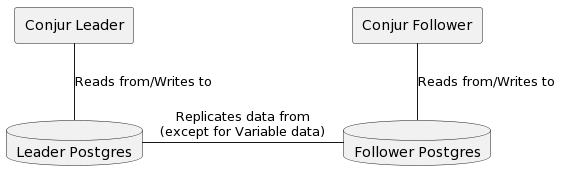

# Partial Replication Using PG Logical

## Overview



- Replicate all data EXCEPT for Variables not explicitely granted to
  a particular follower.

## Vocabulary

- **Follower Replica**: A Conjur follower which contains a subset of secrets from contained in the leader.
- **Replica Set**: A set of variables to be replicated to a particular follower.

## Steps For Enabling Partial Replication

In the following example, I will refer to two instances: a leader, and a follower. The steps taken on each to enable partial replication can be scaled to additonal followers (with additional replica sets).

### Preperation

### Postgres

- Leader and Follower
  - Update `postgres.conf` with the following changes:

    ```conf
    #
    listen_addresses = '*' # allows listening on localhost and external network
    wal_level = 'logical'
    max_worker_processes = 10 # one per database needed on provider node
    max_replication_slots = 10 # one per node needed on provider node
    max_wal_senders = 10 # one per node needed on provider node
    shared_preload_libraries = 'pglogical'
    track_commit_timestamp = on
    pglogical.conflict_resolution = 'last_update_wins'
    ```

  - Update `pg_hba.conf` with the following changes (to allow the follower
    to connect with the leader):

    ```conf
    # PG Logical Hosts:
    # NOTE: the machine's IP and replica's IP is required for pglogical to work
    host    all             all             0.0.0.0/0               md5
    ```

## Resources

  - [pglogical 2 docs](https://github.com/2ndQuadrant/pglogical/tree/REL2_x_STABLE/docs)
- [EDB pglogical v3 docs](https://content-www.enterprisedb.com/docs/pglogical/latest/)
  - [https://medium.com/@Navmed/setting-up-replication-in-postgresql-with-pglogical-8212e77ebc1b](https://medium.com/@Navmed/setting-up-replication-in-postgresql-with-pglogical-8212e77ebc1b)


## Old

1. On leader postgresql.conf file, set `wal_level = logical`
    1.A. Log onto Leader PG: `psql -h localhost -U postgres -W postgres`
    1.B. verify by issuing `SHOW wal_level;`.  Result should be:

        ```
        postgres=# show WAL_LEVEL;
        wal_level
        -----------
        logical
        (1 row)
        ```
2. Run setup

    ```sh
    rake partial_replication:setup
    ```

3. On Leader, run: `CREATE PUBLICATION partial_replica_publication FOR TABLE annotations,authenticator_configs,credentials,host_factory_tokens,permissions,policy_log,policy_versions,resources,resources_textsearch,role_memberships,roles,slosilo_keystore;`

4. Log into Follower Postgres: `psql -h localhost -p 5433 -U postgres -W postgres`
   1.  Enable replication:
       ```sql
       CREATE SUBSCRIPTION partial_replica_subscription CONNECTION 'host=pg-leader port=5432 dbname=postgres password=Password123' PUBLICATION partial_replica_publication;
       ```


5. Add Policy and set variable data on the Leader

    ```sh
    rake partial_replication:load_data
    ```

6. Verify Policy in Follower

7. Verify Variables not present in Follower

8. Replicate data

    ```sh
    rake partial_replication:replicate
    ```

9.  Start a listener:

    ```sh
    rake partial_replication:listen
    ```

10. Send a notification:

    ```sh
    rake partial_replication:notify
    ```

## Conjur Enhancements
- Need to be able to get total count to allow for paging
-
